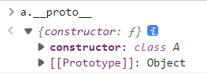
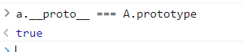
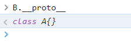

# 原型以及原型链

### 原型链

先来看一个例子：

```javascript
    class A{}
    class B extends A{}
    const a = new A()
    const b = new B()
```

1. 先看一下变量`a.__proto__`的结果是:



可以看见`a.__proto__`显示的结果是一个Object,这个Object构造了A。

2. 再来看一下`a.__proto__ === A.prototype`的输出：



> `prototype`是类A所具有的属性，而这个类的实例对象a，它是A的具象化，`__proto__`本质是`prototype`的getter()，也就是在调用一个类方法前要构造一个对象然后调用方法去访问属性。

所以有：

```javascript
    a.__proto__ === A.prototype
    b.__proto__ === B.prototype
```

> `B.__proto__`输出结果是？



B是一个继承自A的类，他使用`__proto__`则指向A, **注意不是A的原型实例，因为B不是一个实例**

```javascript
    B.__proto__ === A
    B.prototype.__proto__ === A.prototype
    b.__proto__.__proto__ === A.prototype
```

### JavaScript的继承方式

- 原型链继承

```javascript
    function Parent(){
        this.parentName = "父亲";
    }
    Parent.prototype.getParentName = function(){
        return this.parentName;
    }
    function Child(){
        this.childName = "子类";
    }
    Child.prototype.getChildName = function(){
        return this.childName;
    }

    Child.prototype = new Parent()
    const child = new Child()
    console.log(child.getParentName());
```

- 构造函数继承（采用call和apply）

```javascript
    function Parent(name){
        this.name = name;
        this.hobbies = ["sing","dance","rap"];
    }
    function Child(name){
        Parent.call(this.name);
        this.age = 28;
    }
    let child1 = new Child('1');
    let child2 = new Child('2');

    child2.hobbies.push('coding');
    console.log(child2.hobbies);
```

- 组合继承

```javascript
    function Parent(name){
        this.name = name;
        this.hobbies = ["sing","dance","rap"];
    }
    Parent.prototype.getParentName = function(){
        return this.name;
    }
    function Child(){
        Parent.call(this.name);
        this.age = 28;
    }
    Child.prototype.getChildName = function(){
        return this.name;
    }

    Child.prototype = new Parent('父亲')
    const child = new Child()
    console.log(child.getParentName());
```

- 共享原型继承

```javascript
    function Parent(){}
    Parent.prototype.hobbies = ["sing","dance","rap"];
    function Child(name,age){
        this.name = name;
        this.age = 28;
    }
    Child.prototype = Parent.prototype;

    const child = new Child('li',18);
    console.log(child.hobbies);
```

- 寄生组合式继承(最常使用)

```javascript
    class Parent{
        constructor(name){
            this.name = name;
            this.hobbies = ["sing","dance","rap"];
        }
        getHobbies(){
            return this.hobbies;
        }
    }
    class Child extends Parent{
        constructor(name){
            super(name);
        }
    }
    let child1 = new Child('c1');
    let child2 = new Child('c2');
    
    console.log(child1.getHobbies());
```

当然，javascript还有其他的原型继承方式，这里仅仅放了几种常见的继承方式。


